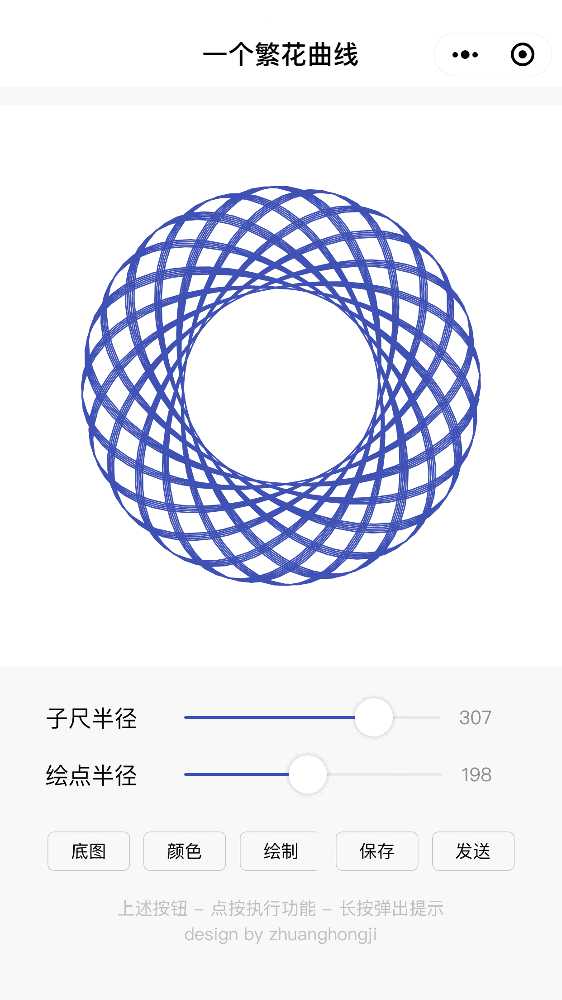
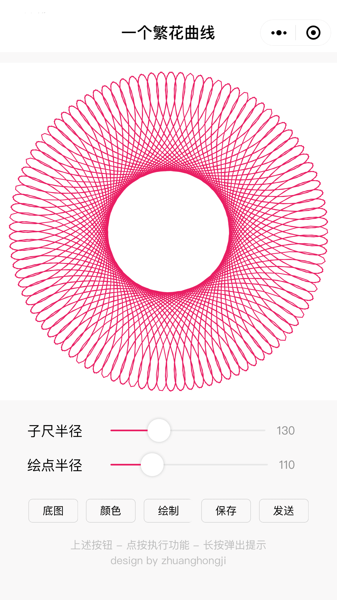

# flowers

微信小程序：一个繁花曲线


## 概述

本项目是繁花曲线在微信小程序上的一个实现。

你可以通过调整「子尺半径」「绘点半径」和「绘制颜色」等参数来绘制各种各样的繁花曲线图，同时支持设置背景图、保存到相册、发送给好友。

TODO: 补充繁花曲线绘制算法文档。

> 具体实现代码，见 codes 目录。


## 截图

| 主页(绘制前) | 主页(绘制后) | 选择绘制颜色
| -- | -- | --
|  |  | 


## 作品展示

| 1 | 2 | 3
| -- | -- | --
|  |  | 

| 4 | 5 | 6
| -- | -- | --
|  |  | 

| 7 | 8 | 9
| -- | -- | --
|  |  | 


## License

```
Copyright (C) 2018 zhuanghongji

Licensed under the Apache License, Version 2.0 (the "License");
you may not use this file except in compliance with the License.
You may obtain a copy of the License at

   http://www.apache.org/licenses/LICENSE-2.0

Unless required by applicable law or agreed to in writing, software
distributed under the License is distributed on an "AS IS" BASIS,
WITHOUT WARRANTIES OR CONDITIONS OF ANY KIND, either express or implied.
See the License for the specific language governing permissions and
limitations under the License.
```
